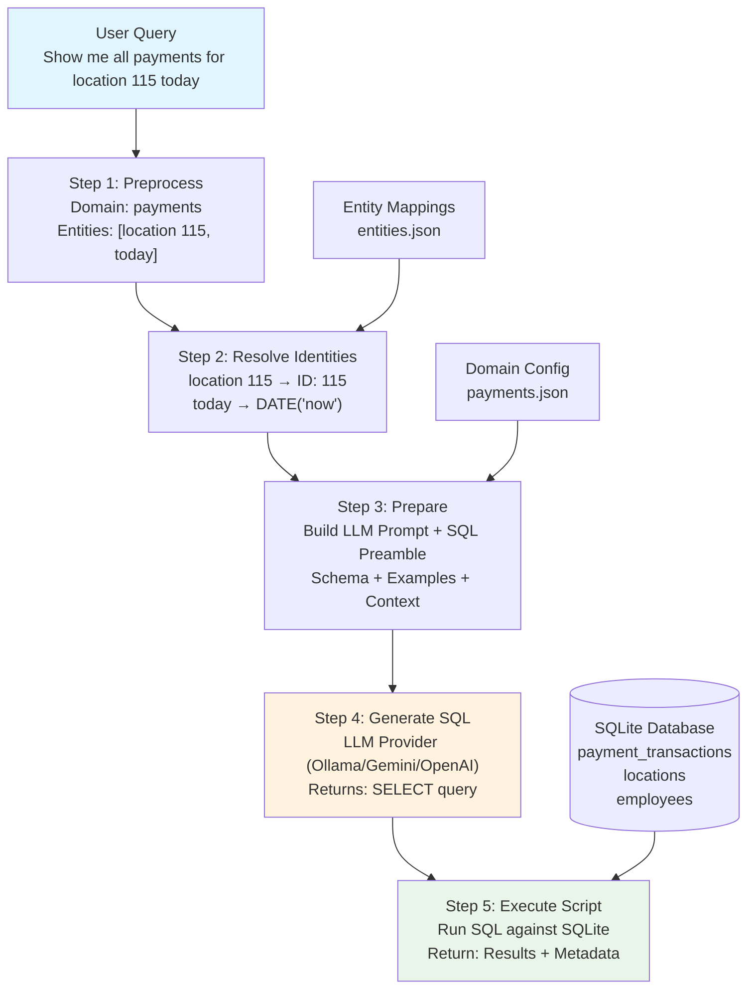

# FinDashers - NL2SQL for Adyen Payment Data

## Overview
FinDashers is a Natural Language to SQL system specifically designed for querying Adyen payment webhook data in QSR (Quick Service Restaurant) environments. It allows users to ask natural language questions about payment transactions, revenue analytics, and operational metrics through both a REST API and a React web interface.

## Architecture

The system follows a 5-step NL2SQL processing pipeline:
1. **Preprocess** - Domain classification and entity extraction
2. **Resolve Identities** - Convert named entities to database IDs
3. **Prepare** - Build LLM prompt with domain context
4. **Generate SQL** - Use LLM to create SQL query
5. **Execute Script** - Run SQL against SQLite database



## Project Structure

```
FinDashers/
├── FinDashers.API/          # .NET 8 Web API
│   ├── Controllers/         # REST API endpoints
│   ├── Models/             # API request/response models
│   └── Program.cs          # API configuration
├── FinDashers.Core/         # Core business logic
│   ├── Services/           # Core services
│   │   ├── LLMProviders/   # LLM provider implementations
│   │   ├── NL2SQLService.cs # Main processing pipeline
│   │   ├── LLMService.cs   # LLM provider management
│   │   ├── DomainManager.cs # Domain context handling
│   │   ├── EntityResolver.cs # Entity resolution
│   │   └── SQLExecutor.cs  # Database execution
│   ├── Models/             # Domain models
│   └── Configuration/      # Configuration models
├── findashers-web/          # React TypeScript frontend
│   ├── src/components/     # React components
│   └── src/services/       # API service layer
├── data/
│   ├── domains/            # Domain configurations (JSON)
│   ├── entities/           # Entity-to-ID mappings (JSON)
│   └── databases/          # SQLite databases
├── FinDashers.sln          # Visual Studio solution
└── README.md               # This file
```

## Features

### Multi-LLM Provider Support
- **Ollama** (local, default for development)
- **Google Gemini**
- **OpenAI GPT**
- **Anthropic Claude**
- **Azure OpenAI**

Providers are tried in order with automatic failover.

### Domain-Specific Processing
- Payment transaction analysis
- Revenue reporting and analytics
- Employee performance metrics
- Failed payment investigation
- Location-based reporting

### Entity Resolution
- Automatic extraction of named entities (locations, employees, terminals)
- Mapping of human-readable names to database IDs
- Context-aware entity disambiguation

### Web Interface
- React TypeScript frontend with Material-UI
- Real-time query processing
- Interactive data visualization with Recharts
- Responsive design for desktop and mobile

### API Endpoints
- `POST /api/query/query` - Process natural language queries
- `GET /api/query/domains` - Get available domains and providers
- `GET /api/query/test/{index}` - Run predefined test queries
- `GET /api/query/health` - Health check endpoint

## Technology Stack

### Backend (.NET 8)
- ASP.NET Core Web API
- Entity Framework Core
- SQLite database
- Dapper for SQL execution
- Dependency injection
- Swagger/OpenAPI documentation

### Frontend (React)
- React 19 with TypeScript
- Material-UI components
- Axios for HTTP requests
- Recharts for data visualization
- React Router for navigation

## Getting Started

### Prerequisites
- .NET 8 SDK
- Node.js 16+ (for frontend)
- At least one LLM provider API key

### Backend Setup
1. Clone the repository
2. Configure LLM providers in `FinDashers.API/appsettings.json`:
   ```json
   {
     "LLMProviders": {
       "Ollama": {
         "BaseUrl": "http://localhost:11434",
         "ModelName": "llama3.2"
       },
       "Gemini": {
         "ApiKey": "your-gemini-api-key"
       },
       "OpenAI": {
         "ApiKey": "your-openai-api-key"
       }
     }
   }
   ```
3. Build and run:
   ```bash
   dotnet build
   dotnet run --project FinDashers.API
   ```
4. API will be available at `https://localhost:7071`

### Frontend Setup
1. Navigate to the web directory:
   ```bash
   cd findashers-web
   ```
2. Install dependencies:
   ```bash
   npm install
   ```
3. Start development server:
   ```bash
   npm start
   ```
4. Web app will be available at `http://localhost:3000`

## Example Queries

### Revenue Analysis
- "Show me all payments for location 115 today"
- "What's the total revenue processed by employee 3836?"
- "Show today's revenue by payment method"
- "What's the average transaction amount for store 2054?"

### Transaction Investigation
- "How many failed payments do we have?"
- "Show me refunded payments this week"
- "List all payments for check ID 692cb24db93afd5132436601"
- "Find all transactions over $50"

### Performance Metrics
- "Which terminal processed the most transactions?"
- "Show all Mastercard transactions"
- "Which employee has the highest transaction volume?"

## Database Schema

The system uses SQLite with the following main tables:
- `payment_transactions` - Adyen webhook payment data
- `locations` - Restaurant location reference
- `employees` - Employee reference data

## Configuration

### Domain Configuration
Domain-specific settings are stored in `data/domains/payments.json` including:
- SQL schema definitions
- Few-shot examples for LLM training
- Join hints and query patterns
- Database connection strings

### Entity Mappings
Entity resolution mappings are stored in `data/entities/entities.json` for:
- Location names to IDs
- Employee names to IDs
- Terminal identifiers

## Development

### Adding New LLM Providers
1. Implement `ILLMProvider` interface
2. Register in `Program.cs`
3. Add configuration section

### Adding New Domains
1. Create domain configuration JSON
2. Set up database schema
3. Configure entity mappings
4. Add few-shot examples

## API Documentation
Swagger documentation is available at `/swagger` when running in development mode.